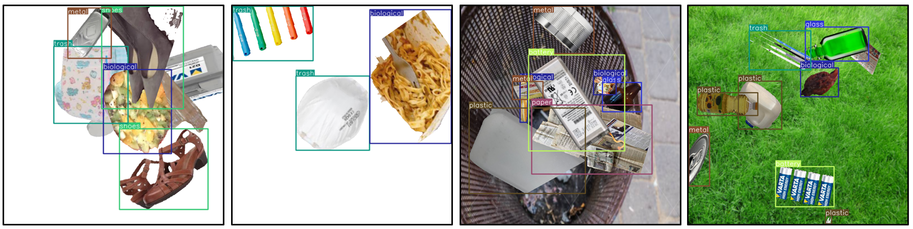
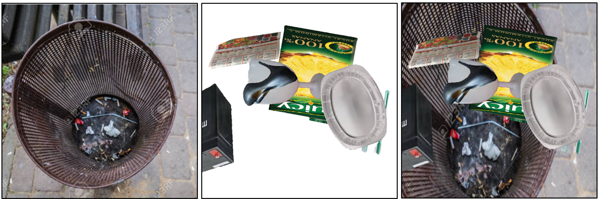
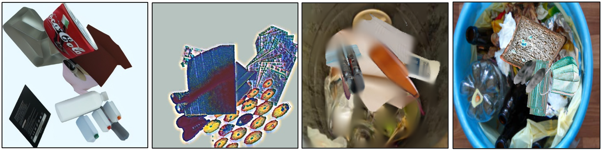

<!-- <head>
    
</head>
 -->
# Trash Sorting Algorithm - Computer Vision

*Björn Bucksch, Samuel Goldie, Per Skullerud*

*Technical University of Delft*

---

## ABSTRACT

This project investigates the fine-tuning of object detection models, in particular YOLO v8, for the task of identifying and classifying different types of trash in images. Due to the lack of a suitable labeled dataset, a custom dataset is created by editing individual trash objects - such as plastic bottles - and their respective bounding boxes into a background image. Data augmentation techniques, including rotation, scaling, and color manipulation, are applied to make the dataset more realistic and improve the model's robustness and generalizability. In order to test whether the model is able to adapt to real-life scenarios, the test set consists of real (un-edited) annotated images containing trash. Furthermore, two different types of backgrounds are tested to determine what is most effective: white and natural backgrounds. The fine-tuned model achieved a mean average precision (mAP) of **X%** on the test set, proving its effectiveness in detecting and categorizing different trash types. This work shows that by simply fine-tuning existing object detection models, these can perform accurately in complex tasks even if trained on non-real images.

<!-- CHANGE PRECISION -->

## INTRODUCTION

Being able to accurately sort trash and recycle is very important for sustainable living in today’s world. In the Netherlands, trash-sorting plays an especially important role. However, this can represent a challenge for newcomers who, due to their backgrounds, may not be familiar with these practices. Apart from disrupting recycling efforts and increasing costs, incorrect trash sorting can lead to unexpected fines for those who are unaware. This project aims to provide a step in the direction of making the recycling system more newcomer-friendly by developing a robust computer vision-based trash-sorting algorithm, that tells users where to throw pieces of trash identified in an image that the user obtains e.g. by taking a photo with their phone. Using an existing object detection model and a custom dataset built for this purpose, various types of trash are identified and classified. The system's robustness is then tested with real-life images to ensure its accuracy. This innovation not only hopes to help newcomers adapt to Dutch recycling norms, but also to improve overall waste management efficiency. 

Specifically, we seek to build a system that indicates which recycling category (paper, metal, etc.) each individual object in an image belongs to. The simpler case of one object per image is a standard object recognition problem, which can be solved by a classifier trained on a dataset such as [1]. However, in realistic scenarios, trash appears in piles - a more difficult case of multi-instance object detection/classification. Given an appropriate dataset, the problem could be solved by fine-tuning a network such as YOLO [2]. However, while there exists a dataset of individual images with their recycling class labels [3], there is no multi-instance equivalent. In our work, we examine the possibility of making our own synthetic dataset for the task by merging images from [3] into a single image with consequently known labels, while applying appropriate augmentations to enhance generalizability to a real-world domain. Our research question follows naturally:

__How to best generate a multi-instance recycling object image dataset that generalizes to real-world examples?__ 

## BACKGROUND

YOLOv8 and tuning

## METHODOLOGY

### Dataset Generation

Our goal is to generate a synthetic dataset by merging images from [3] onto a background, and noting down the labels. All our attempts share a common base - a static white background with rotated and rescaled individual trash images pasted on top (Figure 1). Specifically, we generate each image according to a set of rules:

1. __Image size__: Each generated images has dimensions 640x640.
1. __Object count__ (sampled ~ N(8,2)): The number of individual pieces of garbage that appear in an image, rounded to the nearest positive integer.
2. __Object center x and y positions__ (sampled ~ N(320, 108)): The position where each object is centered. Using a normal distribution centered at the image's center is motivated by the need to form realistic piles.
3. __Object rescale heigh and width__ (sampled ~ N(256, 64)): The new size of the object added to the image. The resultant stretch is meant to simulate unexpected angles with the camera, as well as intra-class variations.
4. __Object rotation__: We randomly rotate each object, as piles of trash rarely have orientation, especially when photographed from above.
5. __Maximum tolerated occlusion__ (50%): After pasting images on top of existing ones, older images may become too occluded. To address this, we only include labels for object whose pixels remain at least 50% not covered.

__Figure 1__: A few samples of synthetic white (2 left) and textured (2 right) background images with labels.

Clearly, the described ruleset leads to images that are unrealistic due to having a white background. To address this, we attempt to add backgrounds of situations in which piles of garbage may realistically be encountered, such as parks, countertops, trash cans, etc. (Figure 1). Effectively, the white and textured backgrounds represent the two domains that we proceed with in the evaluation section. We have attempted several advanced approaches to generate images that should, theoretically, have a smaller domain distance to real-world images. However, many such attempts have resulted in bizarre images, and we did not proceed in these directions due to time constraints.

<!-- 
__Figure 2__: Applying a background behind synthetically generated objects -->

__Figure 2__: Examples of failed attempts to create more realistic images. Left to right: using AI to generalize objects results in cartoonish styling; using style transfer distorts color consistency; using autoencoders results in blur; using simple augmentations plus histogram matching results in color corruption.

We briefly summarize the advanced techniques we tried using to enhance the realism of images (Figure 2 left to right), and their observed shortcomings:

1. We used a language-vision system [4] in an attempt to replace objects with another instance from the same class, using various prompts similar to "Change the appearance of each object in the image as much as possible while maintaining the object recognizable". The task proved too difficult for AI; the resultant images tend to look animated as opposed to realistic.
2. We used a style transfer system [5] to transfer the style from real garbage images onto our generated synthetic ones. However, this simply resulted in great color distortion and noise.
3. We used an image autoencoder that operates on patches [6]. However, this simply results in blur being applied to the masked patches as opposed to those patches being replaced with a believable instance of the same object.
4. We attempted to use an an ensemble of straightforward augmentations provided by the Albumentations Python library, alongside a histogram matching technique to reduce the color discrepancies between the background and the added objects. However, this results in color/object appearance distortion beyond what is realistic. With appropriate parameter tuning these ideas may be beneficial, but the process is too time-consuming.

Despite the failures, we learn that simple augmentations are more reliable than advanced methods, which should theoretically result in better generalization accuracy.

### Model choice
<!-- Why YOLO v8 -->

The most efficient method to make a model that classifies different types of waste is to use an existing classifier model, and train only the last (few) layers to adapt to the new objects that should be classified, while keeping the rest of the weights frozen. A robust initial model has to be used for this purpose so that it can generalize well.

In order to explore the extent to which the modified model generalizes

## RESULTS

## ANALYSIS

## CONCLUSION & DISCUSSION

## References

- [1] Seredkin, A. V., Tokarev, M. P., Plohih, I. A., Gobyzov, O. A., & Markovich, D. M. (2019, November). Development of a method of detection and classification of waste objects on a conveyor for a robotic sorting system. In Journal of Physics: Conference Series (Vol. 1359, No. 1, p. 012127). IOP Publishing.

- [2]: Sohan, M., Sai Ram, T., & Rami Reddy, C. V. (2024). A review on yolov8 and its advancements. In International Conference on Data Intelligence and Cognitive Informatics (pp. 529-545). Springer, Singapore.

- [3]: Kunwar, S. (2024, December 12). Garbage dataset. Kaggle. https://www.kaggle.com/datasets/sumn2u/garbage-classification-v2 

- [4]: DeepAI https://deepai.org/machine-learning-model/image-editor

- [5]: Zhang, H., & Dana, K. (2018). Multi-style generative network for real-time transfer. In Proceedings of the European Conference on Computer Vision (ECCV) Workshops (pp. 0-0).

- [6]: He, K., Chen, X., Xie, S., Li, Y., Dollár, P., & Girshick, R. (2022). Masked autoencoders are scalable vision learners. In Proceedings of the IEEE/CVF conference on computer vision and pattern recognition (pp. 16000-16009).