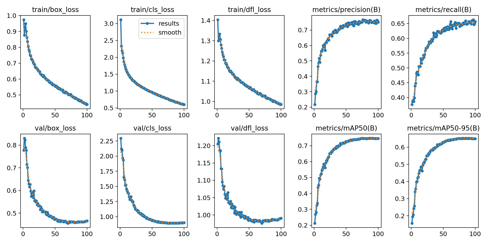

<!-- <head>
    
</head>
 -->
# Trash Sorting Algorithm - Computer Vision

*Björn Bucksch, Samuel Goldie, Per Skullerud*

*Technical University of Delft*

---

## ABSTRACT

This project investigates the fine-tuning of object detection models, in particular YOLO v8, for the task of identifying and classifying different types of trash in images. Due to the lack of a suitable labeled dataset, a custom dataset is created by editing individual trash objects - such as plastic bottles - and their respective bounding boxes into a background image. Data augmentation techniques, including rotation, scaling, and color manipulation, are applied to make the dataset more realistic and improve the model's robustness and generalizability. In order to test whether the model is able to adapt to real-life scenarios, the test set consists of real (un-edited) annotated images containing trash. Furthermore, two different types of backgrounds are tested to determine what is most effective: white and natural backgrounds. The fine-tuned model achieved a mean average precision (mAP) of **X%** on the test set, proving its effectiveness in detecting and categorizing different trash types. This work shows that by simply fine-tuning existing object detection models, these can perform accurately in complex tasks even if trained on non-real images.

<!-- CHANGE PRECISION -->

## INTRODUCTION

Being able to accurately sort trash and recycle is very important for sustainable living in today’s world. In the Netherlands, trash-sorting plays an especially important role. However, this can represent a challenge for newcomers who, due to their backgrounds, may not be familiar with these practices. Apart from disrupting recycling efforts and increasing costs, incorrect trash sorting can lead to unexpected fines for those who are unaware. This project aims to provide a step in the direction of making the recycling system more newcomer-friendly by developing a robust computer vision-based trash-sorting algorithm, that tells users where to throw pieces of trash identified in an image that the user obtains e.g. by taking a photo with their phone. This innovation not only hopes to help newcomers adapt to Dutch recycling norms, but also to improve overall waste management efficiency. 

Specifically, we seek to build a system that indicates which recycling category (paper, metal, etc.) each individual object in an image belongs to; the simpler case of one object per image is a standard object recognition problem. However, in realistic scenarios, trash appears in piles - a more difficult case of multi-instance object detection/classification. Given an appropriate dataset, the problem could be solved by fine-tuning a network such as YOLO [2]. However, while there exists a dataset of individual images with their recycling class labels [3], there is no multi-instance equivalent. In our work, we examine the possibility of making our own synthetic dataset for the task by merging images from [3] into a single image with consequently known labels, while applying appropriate augmentations to enhance generalizability to a real-world domain. To evaluate generalization, we hand-annotate 20 real-world images, and run inference on them using models trained on our synthetic datasets. Our research question follows naturally:

__How to best generate a multi-instance recycling object image dataset that generalizes to real-world examples?__ 

## RELATED WORKS

Niu et. al. [7] have surveyed a range of techniques for realistic image composition. They have identified a set of common problems such as illumination or geometric inconsistency, and have proposed techniques for correcting the visual aspects of appended foreground components. However, virtually all works listed in the survey focus on cases with well-defined structure, i.e. where great attention is given to harmonizing a single object. This is not representative of our task, where the semantic structure is much less important than physics and real-world-context informed details such as the possible positions of trash items and their relative sizes. Furthermore, striving for realism ignores a possibly even more severe problem - the massive intra-class variability of broad recycling classes such as "plastic" or "metal".

A domain-specific attempt to classify multi-instance trash images was proposed by [1], who used a height-sensor at a recycling processing facility to label images of just three classes ("PET", "HDPE", "Aluminium"). With the advanced setup and limited variability (same lighting, conveyor belt background), the authors achieved an mAP of 0.64. The authors cited labelling issues as an important limitation. While our task covers a broader domain of potential input images, we believe that training on artificial data may result in better accuracy since there are significantly fewer labelling challenges. Similarly, departing from a consistent setting may offer greater opportunities for generalization beyond seen objects.

## METHODOLOGY

### Dataset Generation

Our goal is to generate a synthetic dataset by merging images from [3] onto a background, and noting down the labels. All our attempts share a common base - a static white background with rotated and rescaled individual trash images pasted on top (Figure 1). Specifically, we generate each image according to a set of rules:

1. __Image size__: Each generated images has dimensions 640x640.
1. __Object count__ (sampled ~ N(8,2)): The number of individual pieces of garbage that appear in an image, rounded to the nearest positive integer.
2. __Object center x and y positions__ (sampled ~ N(320, 108)): The position where each object is centered. Using a normal distribution centered at the image's center is motivated by the need to form realistic piles.
3. __Object rescale height and width__ (sampled ~ N(256, 64)): The new size of the object added to the image. The resultant stretch is meant to simulate unexpected angles with the camera, as well as intra-class variations.
4. __Object rotation__: We randomly rotate each object, as piles of trash rarely have orientation, especially when photographed from above.
5. __Maximum tolerated occlusion__ (50%): After pasting images on top of existing ones, older images may become too occluded. To address this, we only include labels for object whose pixels remain at least 50% not covered.

__Figure 1__: A few samples of synthetic white (2 left) and textured (2 right) background images with labels.

Clearly, the described ruleset leads to images that are unrealistic due to having a white background. To address this, we attempt to add backgrounds of situations in which piles of garbage may realistically be encountered, such as parks, countertops, trash cans, etc. (Figure 1). Effectively, the white and textured backgrounds represent the two domains that we proceed with in the evaluation section. We have attempted several advanced approaches to generate images that should, theoretically, have a smaller domain distance to real-world images. However, many such attempts have resulted in bizarre images, and we did not proceed in these directions due to time constraints.

<!-- 
__Figure 2__: Applying a background behind synthetically generated objects -->

__Figure 2__: Examples of failed attempts to create more realistic images. Left to right: using AI to generalize objects results in cartoonish styling; using style transfer distorts color consistency; using autoencoders results in blur; using simple augmentations plus histogram matching results in color corruption.

We briefly summarize the advanced techniques we tried using to enhance the realism of images (Figure 2 left to right), and their observed shortcomings:

1. We used a language-vision system [4] in an attempt to replace objects with another instance from the same class, using various prompts similar to "Change the appearance of each object in the image as much as possible while maintaining the object recognizable". The task proved too difficult for AI; the resultant images tend to look animated as opposed to realistic.
2. We used a style transfer system [5] to transfer the style from real garbage images onto our generated synthetic ones. However, this simply resulted in great color distortion and noise.
3. We used an image autoencoder that operates on patches [6]. However, this simply results in blur being applied to the masked patches as opposed to those patches being replaced with a believable instance of the same object.
4. We attempted to use an an ensemble of straightforward augmentations provided by the Albumentations Python library, alongside a histogram matching technique to reduce the color discrepancies between the background and the added objects. However, this results in color/object appearance distortion beyond what is realistic. With appropriate parameter tuning these ideas may be beneficial, but the process is too time-consuming.

Despite the failures, we learn that simple augmentations are more reliable than advanced methods, which should theoretically result in better generalization accuracy.

### Model & Training
<!-- Why YOLO v8 -->

The most efficient method to make a model that classifies different types of waste is to use an existing classifier model, and train only the last (few) layers to adapt to the new objects that should be classified, while keeping the rest of the weights frozen. A robust initial model has to be used for this purpose so that it can generalize well.

We do not aim to maximize accuracy at all costs by picking a state-of-the-art image recognition model, as that is not the focus of our research. We use the industry standard YOLOv8 [2], as it is widely studied and provides high accuracy at a small computation cost. Specifially, we use the YOLOv8 Nano model to minimize fine-tuning time in favour of rapid iteration.

We fine-tune the pre-trained YOLOv8n model provided by Ultralytics. We use the default training regime provided by the Ultralytics Python library, and Weights&Biases for experiment tracking. We generate 10k images from our two investigated settings (white and textured backgrounds), and fine-tune for 100 epochs. As can be seen from Figure 3, the settings result in convergence and avoid overfitting when training on synthetic data.

__Figure 3__: Loss and mAP curves in training and validation. Synthetic textured background image dataset results.

## RESULTS
To evaluate whether training on more realistic synthetic images leads to better performance on real-world data, we tested our two YOLOv8n models (one trained on white-background synthetic images and the other trained on textured-background synthetic images) on a set of 30 real-world images that we captured and manually labeled. Each image contained multiple pieces of trash, and we used a custom GUI to draw bounding boxes and assign labels for each object.

Table 1 summarizes the performance of both models. We report **precision**, **recall**, **mAP@0.50**, and **mAP@[0.50–0.95]**, which are standard metrics for object detection. We also include a “*fitness*” metric as computed by the YOLOv8 library, which offers a single-value proxy for overall performance.

| **Training Data**           | **Precision** | **Recall** | **mAP@0.50** | **mAP@0.50–0.95** | **Fitness** |
|-----------------------------|---------------|-----------|-------------|-------------------|------------|
| White-Background (WB)      | 0.3973        | 0.2946    | 0.2890      | 0.1881            | 0.1982     |
| Textured-Background (TB)   | 0.5811        | 0.4545    | 0.4850      | 0.2836            | 0.3037     |

Despite both models being trained purely on synthetic images, the textured-background model demonstrates higher precision (+18.4%), higher recall (+16.0%), and an improved mAP@0.50 (+19.6%) relative to the white-background model. A similar trend is observed for mAP@[0.50–0.95] and the fitness metric.

These results suggest that increasing the realism of the synthetic training images (e.g., adding diverse natural backgrounds) helps the model adapt more effectively to real-world scenes. While the overall performance remains below what might be desired in a production system, the improvements indicate that bridging the domain gap between synthetic and real data is a promising direction.

## ANALYSIS

The results indicate a clear performance difference between models trained on white-background versus textured-background synthetic images. Although both models were trained exclusively on artificial data, the model that incorporated more realistic backgrounds exhibited substantially higher precision, recall, and mAP on our small 30-image real-world test set. This suggests that domain closeness, achieved by adding diverse natural textures and lighting variations, plays a key role in helping the model generalize.

1.	Domain Gap
Despite the improved performance of the textured-background model, its overall detection and classification accuracy in real-world images remains modest. This underscores a persistent domain gap between synthetic training data and real-world imagery. Variations in object appearance, lighting, and occlusion can be more extreme in reality than in synthetic images, making it difficult for models to fully adapt.

2.	Impact of Background Diversity
The addition of realistic backgrounds appears to lessen this gap. Incorporating different patterns, colors, and contexts in the synthetic images helps the model learn features that are more transferable to real scenes. By contrast, the white-background images lead to limited variation in training data, which affects generalization to real-world clutter and variations in lighting.

3.	Occlusion and Class Confusions
Anecdotal observations from test images revealed that occluded or overlapping objects remain a challenge. Although synthetic data was designed to permit partial overlap, it often does not capture the full complexity of real-world scenes, such as transparent plastics, reflections on metallic items, or unusual object shapes. Consequently, certain classes are misclassified or missed entirely when objects are heavily occluded.

4.	Small Real-World Test Set
Because the real-world evaluation involved only 30 images, the overall metrics must be interpreted with caution. While the trends are informative, future work with a larger, more diverse test set would provide a more robust estimate of real-world performance.

Overall, findings confirm that increasing the realism of synthetic datasets significantly benefits model generalization to real-world trash detection, though a noticeable domain gap remains.

## CONCLUSION & DISCUSSION

This work demonstrates the feasibility of using synthetic images to train an object detection model for multi-instance trash classification, even in the absence of an extensive real-world dataset. By systematically generating synthetic piles of trash with carefully managed bounding boxes, we were able to fine-tune a YOLOv8n model that recognizes and categorizes objects such as plastic, paper, and metal. Crucially, our experiments revealed that increasing the realism of synthetic backgrounds leads to higher performance on real-world images: the model trained on textured-background data outperformed its white-background counterpart by a significant margin in every relevant metric.

Yet, our results also highlight that a noticeable domain gap remains. While textured synthetic images bring the training distribution closer to real-world conditions, mismatches in lighting, object appearances, occlusions, and contextual details still affect generalization. Evaluations on a small set of 30 real images underscore the need for larger and more diverse datasets to further validate performance and reliability. In practical implementations, even moderate misclassification could undermine user trust and the overall utility of an automated recycling assistive tool.

## References

- [1] Seredkin, A. V., Tokarev, M. P., Plohih, I. A., Gobyzov, O. A., & Markovich, D. M. (2019, November). Development of a method of detection and classification of waste objects on a conveyor for a robotic sorting system. In Journal of Physics: Conference Series (Vol. 1359, No. 1, p. 012127). IOP Publishing.

- [2]: Sohan, M., Sai Ram, T., & Rami Reddy, C. V. (2024). A review on yolov8 and its advancements. In International Conference on Data Intelligence and Cognitive Informatics (pp. 529-545). Springer, Singapore.

- [3]: Kunwar, S. (2024, December 12). Garbage dataset. Kaggle. https://www.kaggle.com/datasets/sumn2u/garbage-classification-v2 

- [4]: DeepAI https://deepai.org/machine-learning-model/image-editor

- [5]: Zhang, H., & Dana, K. (2018). Multi-style generative network for real-time transfer. In Proceedings of the European Conference on Computer Vision (ECCV) Workshops (pp. 0-0).

- [6]: He, K., Chen, X., Xie, S., Li, Y., Dollár, P., & Girshick, R. (2022). Masked autoencoders are scalable vision learners. In Proceedings of the IEEE/CVF conference on computer vision and pattern recognition (pp. 16000-16009).

- [7]: Niu, L., Cong, W., Liu, L., Hong, Y., Zhang, B., Liang, J., & Zhang, L. (2021). Making images real again: A comprehensive survey on deep image composition. arXiv preprint arXiv:2106.14490.
